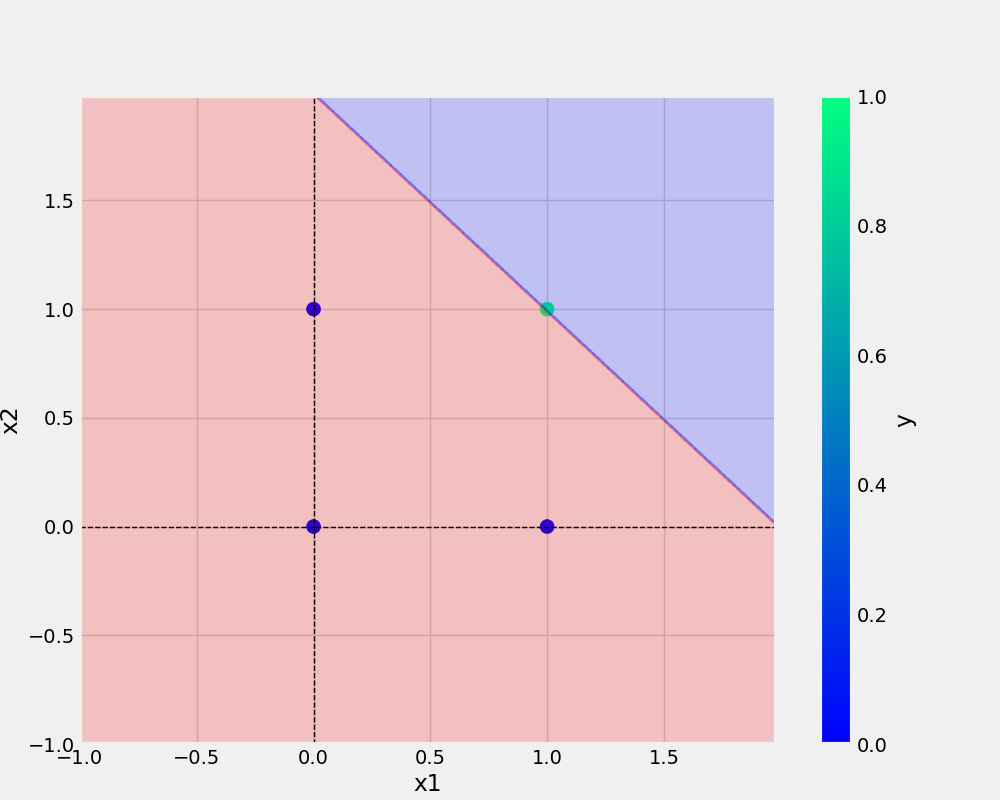

# perceptron-demo
Single Neuron/Perceptron manual implementation using python.

A perceptron is a mathematical representation of a biological neuron of which human brain is made of and this also forms the base of Artificial neural network.

In machine learning, the perceptron is an algorithm for supervised learning of binary classifiers. A binary classifier is a function which can decide whether or not an input, represented by a vector of numbers, belongs to some specific class.

In this project I have demonstrated how a perceptron works on classiying a set of data based on the inputs and the weights associated for each of those set of inputs.

This project shows how the weights are updated using the Weight update rule after each forward propagation and againg used in the next iteration to calculate the output untill zero loss is achieved.

## Article explaining perceptron:- 
[What is Perceptron?](https://towardsdatascience.com/what-the-hell-is-perceptron-626217814f53)

### Ex:- AND dataset
x1 | x2 | y
-|-|-
0|0|1 
0|1|0
1|0|0
1|1|1

#### Image - Plotting the decision regions/boundaries:- AND dataset

##### Jupyter NB implementation
[Perceptron.ipynb](https://colab.research.google.com/drive/1ahYNbOtbHcu82wiiBXV6aAYufAcvjm_X?authuser=1)
